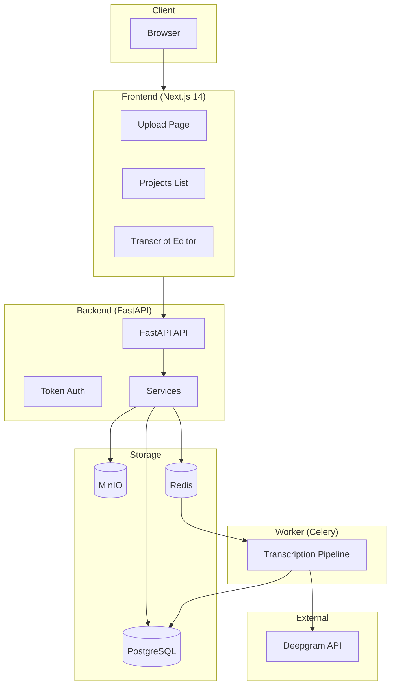
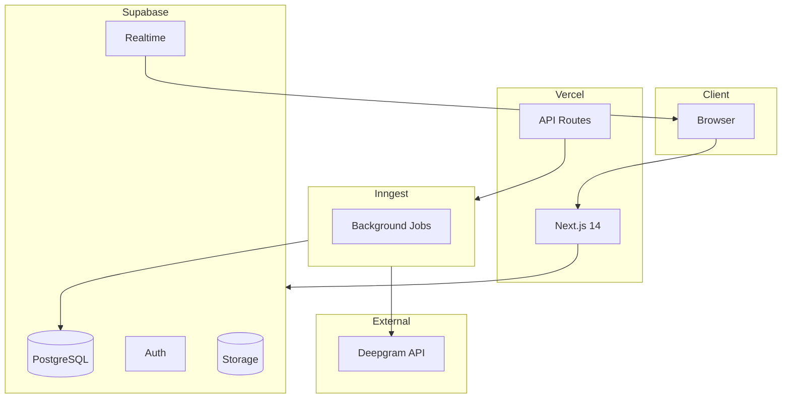
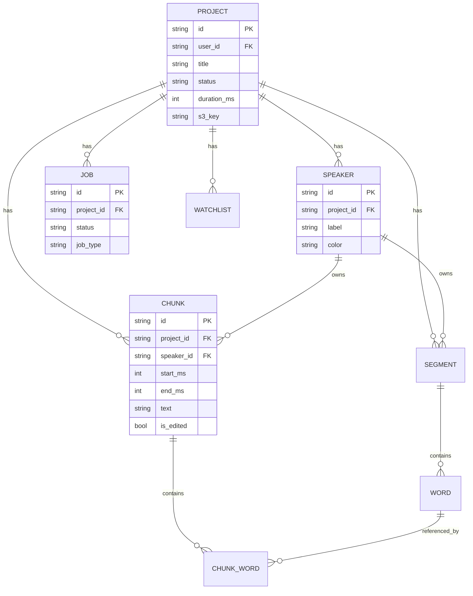
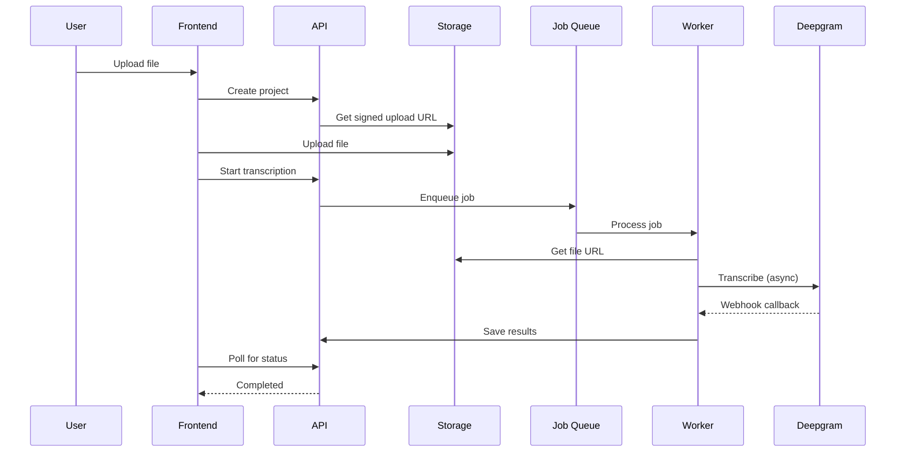

# Architecture Documentation

## System Diagrams

### Current Architecture (Legacy)

### Target Architecture (After Refactor)

## Data Model

## Transcription Flow

## Key Components

### Frontend
- **Upload Page**: File upload + key terms input
- **Projects Page**: List with status, actions, error handling
- **Editor Page**: Waveform player + editable transcript + exports

### Backend (Legacy → Supabase)
- **Projects Router**: CRUD + transcription triggers
- **Export Service**: DOCX, VTT, PDF generation
- **Consolidation Service**: Merges raw segments into display chunks

### Worker (Legacy → Inngest)
- **transcribe_project**: Main transcription task
- Calls Deepgram, parses response, stores segments/words
- Triggers consolidation after import
