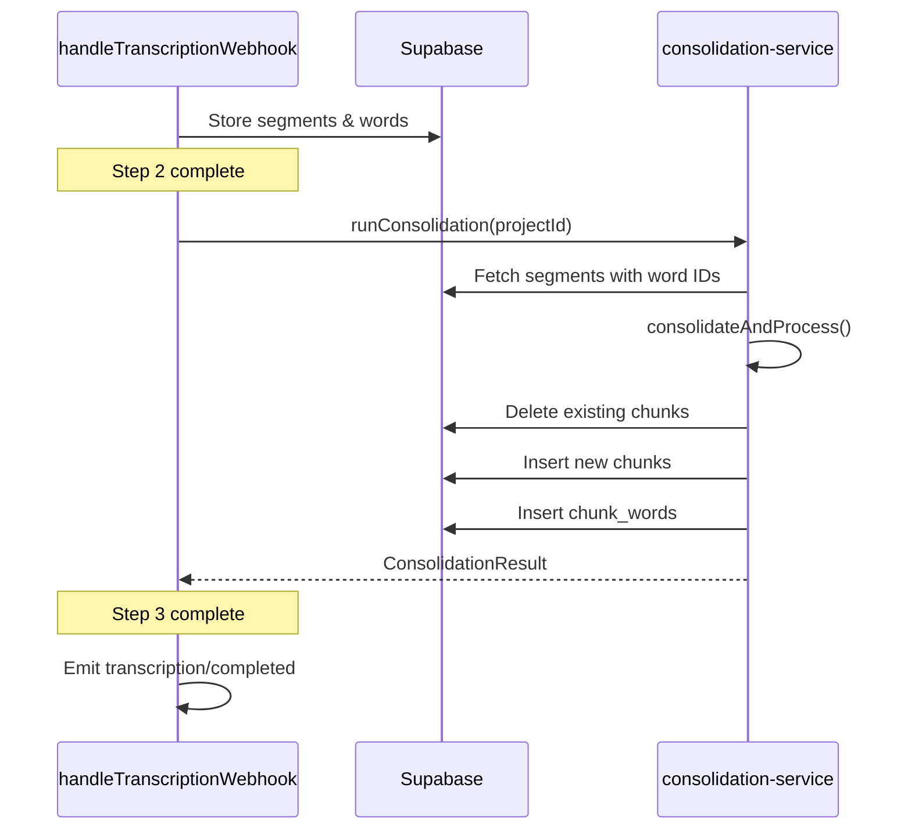

# Phase 6: Consolidation Pipeline Port - Implementation Plan

## Overview

Integrate the TypeScript consolidation algorithm (ported in Phase 0) into the Inngest transcription pipeline. After Deepgram webhook stores segments/words, run consolidation to generate chunks and chunk_words.

---

## Background

From Phase 5, the `handleTranscriptionWebhook` function:
1. Parses Deepgram response
2. Stores segments with speaker mapping
3. Stores words with timestamps
4. Emits `transcription/completed` event

Phase 6 adds consolidation between steps 3 and 4.

---

## Proposed Changes

### lib/inngest

#### [NEW] [consolidation-service.ts](file:///Users/hamzaabikar/Documents/Miscellaneous/Code%20folder/CascadeProjects/TranscriptionAppV1/frontend/lib/inngest/consolidation-service.ts)

A service module that bridges the consolidation algorithm with Supabase:

```typescript
// Functions to implement:

/**
 * Fetch segments and words for a project
 * Returns data in SegmentData format for consolidation
 */
fetchSegmentsWithWords(projectId: string): Promise<SegmentData[]>

/**
 * Run consolidation and save results to Supabase
 * Clears existing chunks first (idempotency)
 * Inserts chunks and chunk_words
 */
runConsolidation(projectId: string): Promise<ConsolidationResult>
```

**Database operations:**
1. Fetch segments ordered by `start_ms`
2. For each segment, fetch word IDs
3. Transform to `SegmentData[]` format
4. Call [consolidateAndProcess()](file:///Users/hamzaabikar/Documents/Miscellaneous/Code%20folder/CascadeProjects/TranscriptionAppV1/frontend/lib/consolidation.ts#282-292) from [lib/consolidation.ts](file:///Users/hamzaabikar/Documents/Miscellaneous/Code%20folder/CascadeProjects/TranscriptionAppV1/frontend/lib/consolidation.ts)
5. Delete existing chunks for project (idempotency)
6. Insert chunks with:
   - `project_id`, `speaker_id`, `start_ms`, `end_ms`, `text`
   - `source_segment_ids` (UUID array)
   - `is_edited` (false), `is_filler`, `algo_version`
7. Insert chunk_words junction records

---

#### [MODIFY] [functions.ts](file:///Users/hamzaabikar/Documents/Miscellaneous/Code%20folder/CascadeProjects/TranscriptionAppV1/frontend/lib/inngest/functions.ts)

Add consolidation step to `handleTranscriptionWebhook` after storing transcription:

```diff
 // Step 2: Parse and store transcription results
 const transcriptionResult = await step.run("store-transcription", async () => {
     // ... existing code ...
 });

+// Step 3: Run consolidation pipeline
+const consolidationResult = await step.run("run-consolidation", async () => {
+    return await runConsolidation(projectId);
+});

-// Step 3: Trigger completion event
+// Step 4: Trigger completion event
 await step.sendEvent("trigger-completed", {
```

Pass consolidation stats in completion event for logging.

---

## Data Flow



---

## Verification Plan

### Automated Tests

1. **Build verification**
   ```bash
   cd frontend && npm run build
   ```
   Expected: ✓ Compiled successfully

2. **Inngest function registration**
   ```bash
   npx inngest-cli@latest dev
   ```
   Visit http://localhost:8288 and verify 4 functions registered

### Manual Verification

1. **End-to-end transcription flow**
   - Start a new transcription via UI
   - Verify segments/words stored in Supabase
   - Verify chunks/chunk_words generated after consolidation
   - Check chunk text is normalized and merged correctly

2. **Consolidation correctness**
   - Verify `source_segment_ids` links back to original segments
   - Verify `is_filler` detection works
   - Verify `algo_version` is "v1.3-ts"

3. **Idempotency**
   - Trigger same webhook twice
   - Verify no duplicate chunks created

---

## Implementation Notes

### SegmentData Transformation

The consolidation expects [SegmentData](file:///Users/hamzaabikar/Documents/Miscellaneous/Code%20folder/CascadeProjects/TranscriptionAppV1/frontend/lib/consolidation.ts#50-58):
```typescript
interface SegmentData {
    id: string;
    speakerId: string | null;
    startMs: number;
    endMs: number;
    text: string;
    wordIds: string[];  // Word UUIDs for chunk_words
}
```

From Supabase segments, map:
- [id](file:///Users/hamzaabikar/Documents/Miscellaneous/Code%20folder/CascadeProjects/TranscriptionAppV1/frontend/lib/consolidation.ts#164-237) → [id](file:///Users/hamzaabikar/Documents/Miscellaneous/Code%20folder/CascadeProjects/TranscriptionAppV1/frontend/lib/consolidation.ts#164-237)
- `speaker_id` → `speakerId`
- `start_ms` → `startMs`
- `end_ms` → `endMs`
- `text` → `text`
- Query `words` table for `wordIds`

### Chunk_words Junction Table

The `chunk_words` table requires:
- `chunk_id`: UUID of the inserted chunk
- `word_id`: UUID of the word
- `order_index`: Position in chunk (0-based)

The consolidation algorithm returns `wordIds` per chunk, which are the word UUIDs to insert.

### Error Handling

- If consolidation fails, let the Inngest [onFailure](file:///Users/hamzaabikar/Documents/Miscellaneous/Code%20folder/CascadeProjects/TranscriptionAppV1/frontend/lib/inngest/functions.ts#43-65) handler emit `transcription/failed`
- Clear chunks before insert to handle retries
- Log chunk/word counts for debugging
