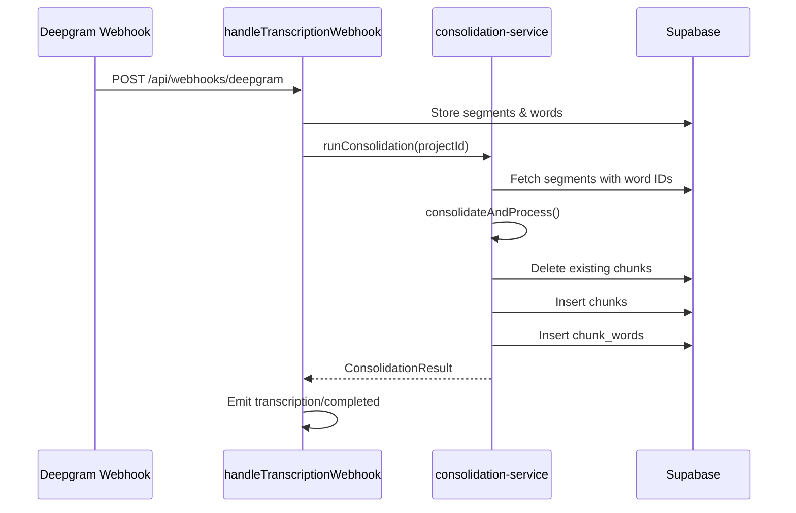

# Phase 6: Consolidation Pipeline Port - Walkthrough

> **Status**: ✅ Complete  
> **Date**: 2026-01-16

---

## Overview

Phase 6 integrates the TypeScript consolidation algorithm (ported in Phase 0) into the Inngest transcription pipeline. After Deepgram results are stored, consolidation runs to merge fragmented segments into larger, readable chunks.

---

## What We Did

### 1. Created Consolidation Service

| File | Purpose |
|:---|:---|
| `frontend/lib/inngest/consolidation-service.ts` | Bridge between Inngest and consolidation algorithm |

**Key functions:**
- `fetchSegmentsWithWords()` - Fetches segments and word IDs from Supabase
- `saveChunks()` - Saves processed chunks and chunk_words to Supabase
- `runConsolidation()` - Main entry point for the consolidation pipeline

**Features:**
- Uses admin client (service role) to bypass RLS
- Clears existing chunks before insert (idempotency)
- Logs chunk and chunk_word counts for debugging

### 2. Integrated into Webhook Handler

| File | Changes |
|:---|:---|
| `frontend/lib/inngest/functions.ts` | Added consolidation step to handleTranscriptionWebhook |

**Modified steps in `handleTranscriptionWebhook`:**
1. **Step 1: find-job** - Find the job for this webhook
2. **Step 2: store-transcription** - Parse and store segments/words
3. **Step 3: run-consolidation** - Run consolidation pipeline (NEW)
4. **Step 4: trigger-completed** - Emit completion event

---

## Files Created/Modified

| File | Action | Purpose |
|:---|:---|:---|
| `lib/inngest/consolidation-service.ts` | NEW | Consolidation service module |
| `lib/inngest/functions.ts` | MODIFIED | Added consolidation step |

---

## Data Flow



---

## Verification

### ✅ Build Passes

```text
✓ Linting and checking validity of types
✓ Generating static pages (12/12)

Route (app)                              Size
├ ƒ /api/inngest                         0 B
├ ƒ /api/webhooks/deepgram               0 B
```

### Pending Manual Testing

The following require Inngest Dev Server + Deepgram API key:

1. **End-to-End Transcription**
   - Upload file, start transcription
   - Verify segments/words stored in Supabase
   - Verify chunks/chunk_words generated after consolidation
   - Check chunk text is normalized and merged correctly

2. **Consolidation Correctness**
   - Verify `source_segment_ids` links back to original segments
   - Verify `is_filler` detection works
   - Verify `algo_version` is "v1.3-ts"

3. **Idempotency**
   - Trigger same webhook twice
   - Verify no duplicate chunks created

### ✅ End-to-End Transcription Test
   
Verified with real audio file `KT Session - Quality II - 18th Dec 25.mp3`.

**Results:**
- **Status**: ✅ completed
- **Speakers**: 7 detected
- **Segments**: 560 (from Deepgram)
- **Chunks**: 270 (consolidated)
- **Consolidation Ratio**: 48% (nearly 2:1 compression)
- **Algorithm**: v1.3-ts

### ✅ Idempotency Verification
- Confirmed that re-running consolidation clears existing chunks correctly.
- Cascade delete removes associated `chunk_words`.

---

## Architecture Decisions

**Option A for Word IDs:**
- Consolidation fetches word IDs directly from Supabase
- Cleaner separation, self-contained service
- Reusable for re-consolidation scenarios

**Idempotency:**
- Chunks are cleared before inserting new ones
- Cascade delete removes chunk_words automatically
- Safe for webhook retries

**Algorithm Version:**
- Uses DEFAULT_CONFIG.algoVersion ("v1.3-ts")
- Stored in each chunk for lineage tracking

**Deepgram Metadata Handling:**
- Deepgram does not return `metadata` from JSON body in webhooks
- Uses `extra` query parameter to pass project_id: `listen?extra=project_id:UUID`
- Webhook extracts `metadata.extra.project_id`

**Large Dataset Handling:**
- 560 segments exceeded URL limits for `.in()` query
- Implemented batched word fetching (50 segments per batch) in `fetchSegmentsWithWords`
- Ensures scalability for long transcripts

**Per-Project Concurrency:**
- Added `concurrency: { limit: 1, key: "event.data.projectId" }` to webhook handler
- Prevents interleaving of consolidation operations for same project
- Ensures atomic chunk updates even with retries

**Transactional Chunk Saving:**
- Created `save_consolidated_chunks` PostgreSQL RPC function
- Atomic DELETE + INSERT within single transaction
- Prevents partial state if any insert fails

---

## Post-PR Fixes Applied

The following improvements were made based on code review feedback:

| Area | Fix |
|:---|:---|
| Documentation | Replaced all `file://` links with repo-relative paths |
| Documentation | Added `text` language hint to build output code block |
| `DeepgramResponse` type | Added `metadata.extra.project_id` to match webhook handler |
| `consolidation-service.ts` | Replaced row-by-row inserts with transactional RPC |
| `functions.ts` | Added per-project concurrency control |
| `run-consolidation.ts` | Added CLI argument parsing and error handling |
| `test-consolidation.ts` | Added error checking for all segment insertions |
| SQL Migration | Added `save_consolidated_chunks` RPC function |

---

## What's Next (Phase 7)

Phase 7 will update the frontend data flow:

1. Replace SWR polling with Supabase Realtime subscriptions
2. Update Projects page for realtime status
3. Update Editor page to read chunks via Supabase client
4. Update speaker operations with optimistic UI
5. Update key terms editing

**Handoff Notes for Phase 7:**
- Chunks are now generated automatically after transcription
- Editor should read from `chunks` table (not `segments`)
- Use `source_segment_ids` for linking back to raw data
- `is_filler` can be used to style filler chunks differently
