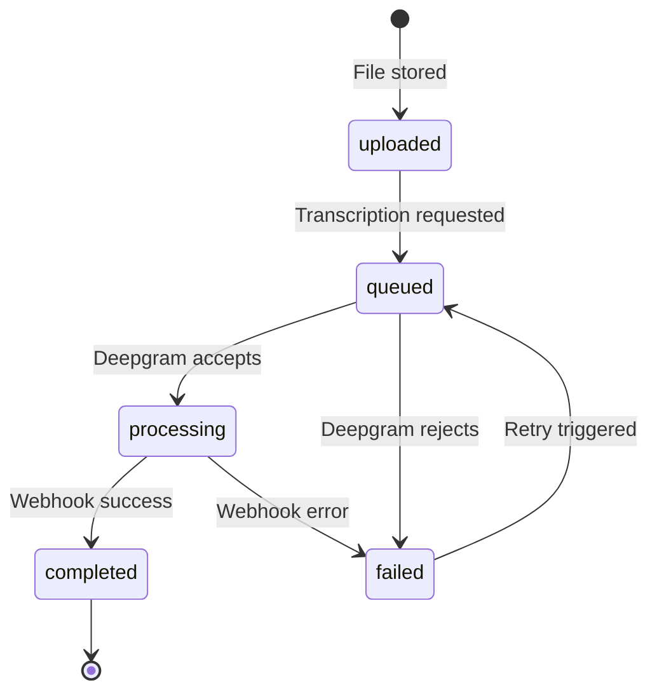

# V2 Targeted Rewrite — Combined Scope

**Date:** 2026-02-13
**Approach:** Targeted rewrite, not full reset. Keep Next.js + Supabase + Inngest. Harden boundaries, normalize the data model, modernize the frontend, and ship via additive migrations + feature-flagged cutover.

> [!IMPORTANT]
> This scope combines recommendations from two independent analyses. It preserves the current tech stack (Next.js 14, Supabase, Inngest, Deepgram) while restructuring the code for long-term maintainability.

## Guiding Constraints

- Keep async pipeline orchestration with Inngest.
- No big-bang rewrite or downtime migration.
- No dual canonical transcript model at steady state.
- Every architectural change must be testable independently.

---

## 1. Clear Boundaries — Code Architecture

### Current Problem
All domain logic (transcription pipeline, consolidation, Deepgram integration, exports, rate limiting) lives inside Next.js `app/api/` routes and `lib/`. There's no separation between UI concerns, transport, and business logic.

| Current Path | Lines | Problem |
|:-------------|:------|:--------|
| `lib/inngest/functions.ts` | 879 | Pipeline, DB writes, error handling, consolidation — all in one file |
| `lib/deepgram.ts` | ~200 | Tightly coupled to Inngest function internals |
| `lib/consolidation.ts` | ~250 | Called inline from Inngest, no independent testability |
| `lib/exports.ts` | ~240 | Export logic mixed with library concerns |
| `lib/supabase/queries.ts` | ~230 | Ad-hoc query functions, no domain boundary |

### Target Structure

```
frontend/
├── app/                    # Next.js pages + API routes (thin transport layer)
│   ├── api/                # HTTP handlers: validate input → call core → return response
│   └── (pages)/            # UI routes
├── components/             # Presentational React components
├── hooks/                  # UI-specific React hooks
├── core/                   # ← NEW: Domain logic layer
│   ├── transcription/      # State machine, Deepgram integration
│   ├── jobs/               # Job lifecycle, timeout detection
│   ├── media/              # Upload, storage, signed URLs
│   ├── transcript/         # Consolidation, versioning, editing
│   ├── speakers/           # Speaker management
│   ├── exports/            # DOCX, VTT, PDF generation
│   ├── permissions/        # Auth checks, RLS helpers
│   └── limits/             # Rate limiting, usage caps, billing hooks
├── contracts/              # ← NEW: Typed contracts (Zod schemas)
│   ├── api.ts              # Request/response schemas
│   ├── events.ts           # Inngest event schemas
│   └── db.ts               # Database DTOs
├── infra/                  # External service adapters
│   ├── supabase/           # Supabase client, admin, queries
│   ├── inngest/            # Inngest client, event registration
│   └── deepgram/           # Deepgram API wrapper
└── lib/                    # Pure utilities (logger, helpers)
```

### Rules
- **`app/api/` routes** do only: parse input → validate with Zod → call `core/` → serialize response. No DB queries, no business logic.
- **`core/`** contains all domain logic. It receives typed inputs and returns typed outputs. It may call `infra/` for external services but never imports from `app/` or `components/`.
- **`contracts/`** is the single source of truth for data shapes. Both API routes and core services import from here. No `any` types crossing boundaries.
- **`infra/`** wraps external services (Supabase, Deepgram, Inngest) behind stable interfaces so they can be swapped or mocked independently.

---

## 2. Typed Contract Package

### Current Problem
Types are scattered across `lib/supabase/types.ts`, `lib/inngest/events.ts`, and inline in route handlers. Many boundaries pass untyped objects or use `any`.

### What Changes
- Create `contracts/` directory with Zod schemas for:
  - **API payloads**: request bodies, query params, and response shapes for every route
  - **Inngest events**: typed event data replacing the current loose `events.ts`
  - **Database DTOs**: type-safe representations of DB rows, replacing inline Supabase inference
- All API route handlers validate input with `schema.parse()` — no manual `if (!body.field)` checks
- All Inngest function handlers receive typed event data
- Export inferred TypeScript types from Zod schemas (single source of truth)

---

## 3. Transcription State Machine

### Current Problem
Project status and job status are loosely managed. Status transitions happen in multiple places (API routes, Inngest functions, webhook handlers) with no central enforcement.

### Current States (informal)
```
Project: created → processing → completed → error
Job:     queued → processing → completed → error
```

### Target: Strict State Machine



### What Changes
- Define state transitions in `core/transcription/machine.ts` with explicit guards
- Every transition persists a `job_events` audit record (see §4)
- Invalid transitions throw — no silent state corruption
- Transition functions encapsulate side effects (e.g., `queued→processing` updates `started_at`)
- `projects.status` becomes derived from active job state instead of being independently mutated in multiple code paths
  - if any job is `processing`, project is `processing` (newest processing job wins)
  - else if any job is `queued`, project is `queued` (newest queued job wins)
  - else project reflects the newest terminal job (`completed` or `failed/error`)
- Derivation lives in one resolver function (or SQL view) used by all writers/readers

---

## 4. Normalized Data Model

### Current Schema (8 tables)
`projects`, `speakers`, `segments`, `words`, `chunks`, `chunk_words`, `watchlist`, `jobs`

### Problems
- **Dual transcript representation**: raw `segments/words` + consolidated `chunks/chunk_words` creates confusion about which layer the editor operates on
- **No transcript versioning**: edits mutate chunks in place; regeneration deletes and re-inserts
- **No media file separation**: `source_object_key` lives directly on `projects`
- **No job event audit trail**: job status changes are overwritten, not appended
- **`watchlist` lacks uniqueness constraint** on `(project_id, canonical)`

### Target Schema (11 tables)

| Table | Purpose | New? |
|:------|:--------|:-----|
| `projects` | Project metadata, user ownership | Modified |
| `media_files` | File metadata, storage path, MIME type, duration | **New** |
| `transcription_jobs` | Job lifecycle with strict state machine | Renamed from `jobs` |
| `job_events` | Immutable audit log of every state transition | **New** |
| `transcript_versions` | Versioned transcript snapshots (auto/manual) | **New** |
| `transcript_segments` | Canonical editable segments (replaces chunks) | Replaces `chunks` |
| `transcript_words` | Word-level timestamps linked to segments | Replaces `chunk_words` + `words` |
| `speakers` | Speaker labels and colors | Unchanged |
| `watchlist` | Key terms with uniqueness constraint | Modified |
| `raw_transcriptions` | Immutable Deepgram response blob, for reprocessing | **New** |
| `webhook_receipts` | Idempotency ledger for webhook `request_id` + verification result | **New** |

### Key Design Decisions

1. **`media_files` separated from `projects`**: a project references a `media_file_id`. This enables future features like re-transcribing the same file with different settings.

2. **`transcript_versions`**: each version has a `version_number`, `source` (enum: `deepgram`, `consolidation`, `user_edit`, `regeneration`), and `created_at`. The editor always works on the latest version. Old versions are read-only snapshots.

3. **`transcript_segments` replaces both `segments` and `chunks`**: one canonical layer. On initial transcription, Deepgram utterances are stored as segments. Consolidation creates a new `transcript_version` with improved segments. No dual-layer confusion.

4. **`raw_transcriptions`**: stores the full Deepgram JSON response immutably. Referenced by `transcription_job_id`. Enables reprocessing without re-calling Deepgram.

5. **`job_events`**: append-only log. Schema: `(id, job_id, from_status, to_status, metadata JSONB, created_at)`. Powers debugging, metrics, and audit trails.

6. **`webhook_receipts`**: unique index on `(provider, request_id)` guarantees duplicate delivery is processed once.

7. **Drop `segments`, `words`, `chunks`, `chunk_words`**: replaced by the unified `transcript_segments` + `transcript_words` + `raw_transcriptions` approach.

### Migration Strategy
- New tables are additive first (zero downtime; no destructive renames in initial migrations)
- Dual-write transcript mutations to legacy and new tables during migration window
- Backfill script copies existing `chunks` → `transcript_segments` with a default `transcript_version`
- Backfill script also migrates word timing fidelity:
  - map `chunk_words` → `transcript_words` directly where available
  - fallback map `words` → `transcript_words` by segment/time alignment when needed
- Read-path cutover is feature-flagged per environment after parity verification queries pass
- Parity checks include segment count, word count, text checksum, and timestamp-boundary diffs on sampled projects
- Legacy tables remain read-only for rollback safety, then dropped in a follow-up migration

---

## 5. Webhook Hardening

### Current Problem
The webhook handler at `app/api/webhooks/deepgram/route.ts` stores the payload and emits an Inngest event. It currently performs token-header verification, but not signed payload + timestamp verification, and the route is still subject to Vercel's 4.5 MB body limit (which can fail before handler code executes).

### What Changes
- **Payload-size mitigation (required)**:
  - add intake guardrails (duration/file-size policy) to prevent jobs likely to exceed callback payload limits
  - route large-callback ingress to an endpoint not constrained by Vercel 4.5 MB (for example Supabase Edge Function), while keeping the current route for standard payloads
- **Signature verification**: validate Deepgram webhook signatures (HMAC or shared secret) before processing, including timestamp tolerance to prevent replay
- **Ack fast**: immediately return `200 OK` after storing raw payload to `raw_transcriptions`
- **Process async**: emit Inngest event after ack; all heavy work (parsing, segment creation, consolidation) happens in the Inngest function
- **Retry safety**: webhook handler is idempotent via `webhook_receipts` unique `(provider, request_id)` — re-delivery of the same `request_id` is a no-op

---

## 6. Observability

### Current State
- `lib/logger.ts` exists with correlation IDs (partially implemented)
- No job metrics beyond `started_at`/`finished_at`
- No structured tracing across the pipeline

### What Changes

1. **Structured logging** (extend existing `logger.ts`):
   - Consistent log format across all `core/` services
   - Correlation ID propagated from API request → Inngest event → webhook handler
   - Log levels enforced: `debug` for dev, `info`/`warn`/`error` for production

2. **Job metrics** (derived from `job_events`):
   - Queue latency: `processing.created_at - queued.created_at`
   - Processing time: `completed.created_at - processing.created_at`
   - Failure rate: count of `failed` transitions / total jobs
   - Queryable via Supabase SQL (or future dashboard)

3. **Health endpoint** (keep existing, extend):
   - Add Deepgram API connectivity check
   - Add Inngest connectivity check
   - Report queue depth and oldest pending job

---

## 7. Billing / Limits / Permissions as Domain Concepts

### Current State
Rate limiting exists in `lib/rate-limit.ts` (in-memory). No usage tracking. No billing hooks.

### What Changes

- Move rate limiting into `core/limits/` with a clean interface and pluggable backend
- Use a distributed-friendly backend for counters (Supabase/Postgres) so limits remain correct across multiple app instances
- Define limit types as domain concepts:
  - **Transcription limits**: per-user, per-period caps
  - **File size limits**: configurable per tier (free vs. paid, future)
  - **Storage limits**: total media storage per user
- Track **usage** in a `usage_events` table or aggregated `user_usage` table
- Permissions checks consolidated into `core/permissions/` — every `core/` service calls permission checks before acting, rather than scattering auth checks across API routes

> [!NOTE]
> Billing integration is out of scope for V2. The goal is to establish the domain model and interfaces so billing can be plugged in later without architectural changes.

---

## 8. Frontend — UI Component Decomposition

### Current Problem (God Components)

| Component | Lines | Responsibilities |
|:----------|:------|:----------------|
| `CaptureModal.tsx` | 481 | File upload, validation, key terms, language options, progress, error handling |
| `LibraryView.tsx` | 430+ | Project list, search, filtering, status display, actions, greeting |
| `FindReplaceModal.tsx` | 380+ | Search input, replace input, case toggle, match navigation, highlighting, replace logic |
| `Sidebar.tsx` | 360+ | Navigation, project info, speaker list, settings |

### What Changes

- **Compound component pattern**: break monolithic components into composable sub-components
  ```
  CaptureModal/
  ├── CaptureModal.tsx          # Shell/orchestrator
  ├── FileDropZone.tsx          # Drag-and-drop file selection
  ├── KeyTermsInput.tsx         # Key term chips (already partially extracted in useCapture)
  ├── CaptureOptions.tsx        # Language, diarization toggles
  └── CaptureProgress.tsx       # Upload/processing state
  ```

- **Extract business logic into hooks**: component files should contain only rendering. State management and side effects move to `hooks/`.

- **Component size target**: no single component file exceeds ~200 lines.

---

## 9. React Server Components

### Current State
Most data-heavy pages are currently client components, and initial data fetching for core flows is largely client-side via SWR/hooks.

### What Changes
- **Library/Projects page**: fetch project list server-side, pass as props. SWR only used for real-time status updates after initial hydration.
- **Editor page**: fetch project metadata + transcript server-side. Interactive elements (waveform, editing, playback) remain client components.
- **Auth pages**: already server-compatible, minimal change needed.

### Evaluation Needed
- Assess whether Supabase SSR client (`@supabase/ssr`) works smoothly with RSC data patterns in the current Next.js 14 setup
- May require moving from `"use client"` page-level to layout-level server fetch + client component children

> [!TIP]
> RSC adoption can be incremental. Start with the Library page (read-heavy, low interactivity) as a proof of concept before converting the Editor page.

---

## 10. Test Strategy

### Current State (11 test files, ~92 tests)
Mostly unit tests for utilities (rate limiter, logger, consolidation, exports). Minimal integration or E2E coverage.

### Target Coverage

| Layer | What to Test | Tool |
|:------|:------------|:-----|
| **Core domain** | State machine transitions, consolidation logic, export generation, permission checks | Jest unit tests |
| **API + DB** | Route handlers with real Supabase (local CLI), Inngest event flow | Jest integration tests with Supabase local |
| **Contracts** | Zod schema validation (valid/invalid inputs) | Jest unit tests |
| **UI components** | Component rendering, user interactions | React Testing Library |
| **E2E critical path** | Upload file → transcription completes → open editor → make edit → export | Playwright |

### New Tests to Add

1. **State machine tests**: every valid transition succeeds, every invalid transition throws (`uploaded→queued→processing→completed|failed`, `failed→queued`)
2. **Derived project status tests**: `projects.status` follows explicit precedence rules across multiple jobs/retries (no independent mutation)
3. **Contract validation tests**: every Zod schema rejects malformed input
4. **Webhook idempotency test**: duplicate webhook delivery produces no side effects (verified via `webhook_receipts`)
5. **Webhook ingress limit test**: large-callback policy path is enforced (guardrail/fallback endpoint selection)
6. **Integration test**: `POST /api/projects` → `POST /api/projects/:id/start` → verify job created with correct state
7. **Migration parity test**: dual-write/backfill produces equivalent segment+word transcript output for sampled projects
8. **E2E smoke test**: one complete "upload to transcript ready" path (Playwright)

---

## 11. Summary — What's In / What's Out

### In Scope (V2)

| # | Change | Category |
|:--|:-------|:---------|
| 1 | Restructure into `core/`, `contracts/`, `infra/` layers | Architecture |
| 2 | Typed Zod contract package for all boundaries | Architecture |
| 3 | Transcription state machine with strict transitions | Domain |
| 4 | Normalized data model (11 tables, versioned transcripts) | Database |
| 5 | Webhook signature verification + ack-fast pattern | Pipeline |
| 6 | `job_events` audit table | Observability |
| 7 | `webhook_receipts` idempotency table | Pipeline |
| 8 | Webhook payload-size mitigation path (guardrails + large-callback ingress) | Pipeline |
| 9 | Structured logging + job metrics from `job_events` | Observability |
| 10 | Billing/limits/permissions as domain concepts (interfaces, not billing provider integration) | Domain |
| 11 | Decompose God Components into compound components | Frontend |
| 12 | React Server Components for data-heavy pages | Frontend |
| 13 | Test strategy: core unit + API integration + 1 E2E path | Quality |

### Out of Scope (V2)

| Item | Reason |
|:-----|:-------|
| Drop Inngest / switch to sync Deepgram | Decision: keep async pipeline |
| Billing provider integration (Stripe etc.) | Domain interfaces built, but no provider wired |
| Real-time transcription (live calls) | Future feature |
| Separate backend service (Express/Hono) | Keep Next.js API routes as thin transport |
| Monorepo tooling (Turborepo) | Single project structure maintained |
| Segment split/merge in editor | Existing planned feature, not V2 architecture concern |
| Redis-specific rate limiting infrastructure | Limits become domain-level and distributed-safe via Postgres first |

---

## 12. Phasing (Suggested)

> [!NOTE]
> Phases are suggested execution order. Each phase should be independently deployable and should not break existing functionality.

| Phase | Work | Dependencies |
|:------|:-----|:-------------|
| **Phase 1** | Typed contracts (`contracts/`), `core/` skeleton, move existing logic into core layer | None |
| **Phase 2** | Transcription state machine + `job_events` on current schema | Phase 1 |
| **Phase 3** | Webhook hardening (signature verification, ack-fast, `webhook_receipts`, payload-size mitigation path) | Phase 2 |
| **Phase 4** | Additive data model migration + dual-write + backfill scripts | Phases 2–3 |
| **Phase 5** | Observability (logging extension, job metrics queries, stuck-job alerting) | Phase 2 |
| **Phase 6** | Billing/limits/permissions domain layer + usage tracking tables | Phase 1 |
| **Phase 7** | Frontend decomposition (compound components, hooks extraction) | Phase 1 |
| **Phase 8** | React Server Components spike + incremental rollout (Library first, Editor after validation) | Phase 7 |
| **Phase 9** | Test strategy execution (core tests → integration → E2E) + legacy read-path deprecation gates | Phases 1–8 |

---

## 13. Open Questions for User

1. **Transcript versioning granularity**: should every autosave create a new version, or only pipeline operations + explicit user snapshots?
2. **Dual-write exit criteria**: what parity threshold (for example, 100% row-count + checksum match over N days) is required before cutover?
3. **Legacy table removal timeline**: how long should `segments`/`words`/`chunks`/`chunk_words` stay read-only before dropping?
4. **Webhook large-payload strategy**: do we enforce a strict recording-duration cap in V2, or support a non-Vercel callback ingress for long recordings immediately?
5. **RSC evaluation**: should we run a short compatibility spike before committing Phase 8, or commit now and resolve issues during rollout?
