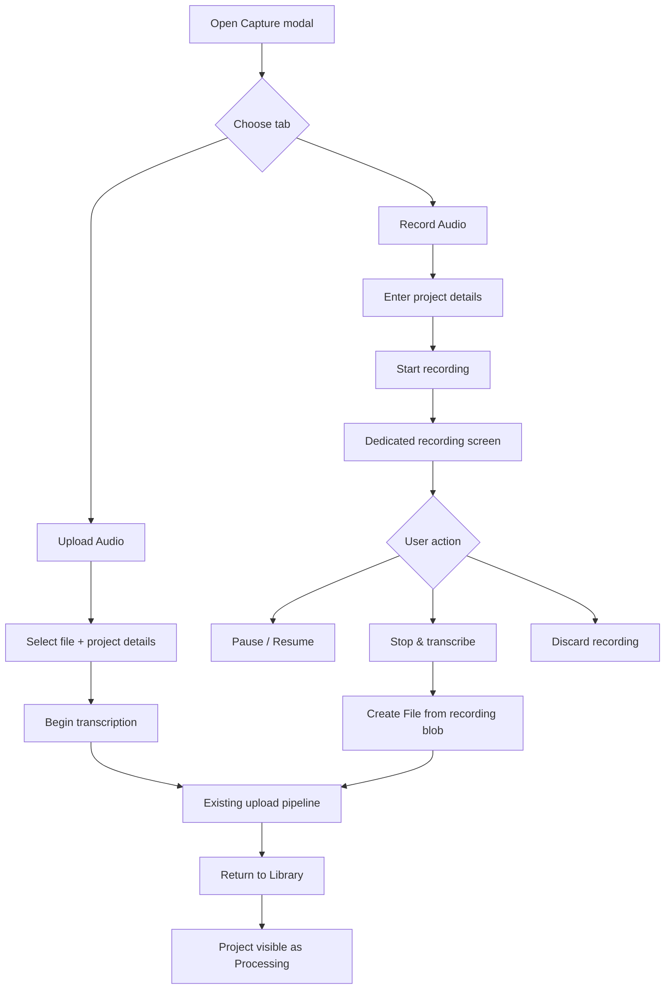

# Live Recording Capture Spec

## Summary

Add a second capture mode that lets a user start a microphone recording from the existing Capture modal, then send the finished recording through the same project creation, media upload, and transcription pipeline already used for uploaded files.

The feature should feel like a sibling of file upload, not a separate product:

- Capture modal gains two top tabs: `Upload Audio` and `Record Audio`.
- Both tabs collect the same project/transcription metadata where the backend currently supports it.
- `Record Audio` launches a dedicated recording screen.
- Stopping a recording turns the captured blob into a file and reuses the existing upload/start flow.
- After successful handoff, the user returns to the library and sees the new project in its normal `Processing` state.

## Product Goals

1. Let a user create a transcription without first making an audio file elsewhere.
2. Keep the recording path visually and conceptually inside the existing capture flow.
3. Reuse the current transcription backend path so recordings and uploads behave identically after capture.
4. Protect users from accidentally losing an in-progress recording.

## Non-goals For The First Release

- True streaming transcription while recording.
- Cross-device or cross-session recovery of unfinished recordings.
- Background upload while the user continues recording.
- Editing the recording before transcription.
- A production live waveform implementation; the first release may use a mocked waveform surface.
- A review/playback step between Stop and submit. Immediate submit on Stop. A future user-settings toggle can insert a review state later — no Phase 1 hooks are pre-built for it.

## Current App Constraints

- The current upload path is:
  1. create project
  2. upload media to Supabase Storage
  3. attach `source_object_key`
  4. start transcription
- The library already displays `queued` and `processing` projects as `Processing`, so a successfully submitted recording can reuse the same downstream behavior.
- The current project creation API accepts `title`, `filename`, and `key_terms`.
- `Language` and `Speaker Diarization` already render in `CaptureDetails.tsx` as disabled `(coming soon)` controls. The Record tab mirrors the same pattern — no new wiring until the backend supports them as real shared settings for both tabs.
- The default media size limit is exposed as `MAX_FILE_SIZE_BYTES` from `lib/supabase/storage.ts` and is currently `50MB`. The recording flow reads this value at session start so size-based behavior tracks the env-driven cap.
- `useCapture.ts` accepts the `.webm` extension but does not currently include `audio/webm` in its allowed MIME list. The recording flow extends `SUPPORTED_MIME_TYPES` with `audio/webm` and `audio/mp4`.

## Recommended UX Flow



## Capture Modal Design

### Tabs

Use a Radix Tabs primitive at the top of the modal body:

- `Upload Audio`
- `Record Audio`

The tabs sit below the modal header and above the tab-specific form content.

### Upload Audio Tab

This is the current flow:

- File drop zone
- Title (optional)
- Language `(coming soon)` — existing disabled control
- Speaker Diarization `(coming soon)` — existing disabled control
- Key terms
- Primary action: `Begin transcription`

### Record Audio Tab

The Record tab collects recording-setup metadata before a live session begins:

- Microphone selector
- `Test microphone` button + live input level meter
- Title (optional)
- Language `(coming soon)` — mirrors the Upload tab's disabled control
- Speaker Diarization `(coming soon)` — mirrors the Upload tab's disabled control
- Key terms

Permission and meter behavior:

- The Record tab does **not** request microphone permission on tab open.
- Clicking `Test microphone` is the first and only point where permission is requested. On grant:
  - The device dropdown populates with real device labels via `MediaDevices.enumerateDevices()`.
  - The input level meter activates, driven by an `AnalyserNode` connected to the live stream.
  - The acquired `MediaStream` is held on the recording session singleton (see Data And Architecture). It is reused on the recording page so the user is never prompted twice.
- Changing the device in the dropdown after `Test microphone` re-acquires `getUserMedia` for the new `deviceId` and rewires the meter.
- The chosen `deviceId` is persisted to `localStorage` under `recording.preferredDeviceId` once permission is granted. On the next visit, if the saved device is still present, it is pre-selected; otherwise the browser default is used and the stale value is cleared.

Primary action: `Start Recording`.

### Footer Behavior

The footer adapts to the selected tab without changing layout:

- Upload tab button text: `Begin transcription`
- Record tab button text: `Start Recording`

The button has a stable minimum width so switching tabs does not resize the footer.

## Recording Experience

### Recommended Surface

Use a dedicated full-page route for the recording session rather than another modal.

Route: `/recording/new`.

Reasoning:

- A real recording session is a focused task with stronger state and safety needs than a modal.
- It avoids stacking a modal on top of a modal-like workflow.
- It gives enough room for timer, waveform, controls, warnings, and future mic/device states.
- A modal would avoid exposing the normal app chrome, but a dedicated page is the better fit for a long-lived, safety-sensitive session. Chrome behavior is solved deliberately by the navigation policy below rather than by hiding the shell.

### Modal-To-Page Handoff

When the user clicks `Start Recording` in the modal:

1. The modal calls `MediaRecorder.start()` on the held stream. The recorder, stream, and chunk buffer are committed to the recording session singleton.
2. The active-time clock starts at the moment `start()` is called.
3. The modal closes and the user is routed to `/recording/new`.
4. The recording page mounts and reads the in-progress session from the singleton — it does not start a new recorder. The page is a visualization of an already-running session, not a second confirmation step.

If the user has not yet clicked `Test microphone`, `Start Recording` triggers the permission request first and only proceeds on grant.

### Page Layout

The recording page shows:

- The project title as the main heading. If the user left the title blank, the page shows the generated fallback `Recording — {locale-formatted date and time}` (see Title And Filename Defaults).
- Recording state: `Recording`, `Paused`, `Saving recording`, or `Uploading`. State changes are announced via an `aria-live="polite"` region.
- Elapsed **active** recording time, excluding paused time.
- Large waveform area. Phase 1 uses an animated placeholder; Phase 4 replaces it with analyser-driven bars.
- Primary controls:
  - `Pause` while recording
  - `Resume` while paused
  - `Stop & transcribe` (hidden while the empty-floor threshold is not met; see Stop Threshold)
  - `Discard recording`
- A dynamic size-budget banner that appears when the recording approaches the configured size cap (see Recording Size Budget).

The recording screen does not include decorative reassurance copy beneath the controls.

### Page Entry Conditions

The page handles three distinct entry conditions on mount:

1. **Fresh handoff from the modal.** The session singleton has a live `MediaRecorder`. The page renders the in-progress recording.
2. **Refresh during a recording.** The singleton is empty (module re-evaluated), `sessionStorage` still holds the metadata draft, and the live recorder/stream are gone. The page renders an explicit `interrupted` state: copy "Your recording was interrupted and could not be recovered", the original title shown, and a single `Start a new recording` button. Clicking it re-requests microphone permission and begins a fresh recording with the same metadata — no return-to-Capture round trip.
3. **Direct URL visit / bookmark.** Singleton empty and no metadata. The page immediately redirects to `/projects` and opens the Capture modal pre-routed to the Record tab with an error banner: "Recording session not found — please start a new recording".

### Header Recording Indicator

While the session singleton reports state `recording` or `paused`, the contextual header renders a compact pill. It reads `● Recording HH:MM:SS` while actively recording and `● Paused HH:MM:SS` while paused, so the chrome reflects the real lifecycle state at a glance. The dot uses `ember-red`; the pill background uses `night-surface`. Clicking the pill navigates to `/recording/new` (through the same guarded navigation as all other in-app routing — see Navigation Policy below). The pill disappears as soon as the session transitions to `submitted` or `discarded`.

The pill exists for two reasons:

- It gives the user a constant tether back to their session if they end up on another route.
- It explains the navigation-confirm behavior in advance, before the user discovers it by clicking a link.

### Navigation Policy

Use a soft lock, not an absolute lock. The app shell stays fully visible and nothing is greyed out:

- A guarded navigation helper wraps `useRouter().push` and all in-app `<Link>` clicks. While the session has unsaved recording data, any in-app navigation attempt opens a confirmation dialog: "Leaving this page will discard your recording. Continue?". Cancel keeps the user on the recording page; confirm transitions the session to `discarded` and performs the navigation.
- While there is unsaved recording data, a `beforeunload` handler is attached so browser-level close, reload, or back-navigation attempts trigger the browser's native warning dialog.
- Browser back is also handled in-app through a `popstate` guard that restores the recording route if the user cancels the discard confirmation.
- The listener is removed the moment the session transitions to `discarded` or `submitted`.

Important limitation:

- The browser warning is a backup, not a guarantee. It is generic, browser-controlled, and not reliably fired in every mobile scenario.

## Recording Lifecycle

Client state machine:

```text
idle
-> recording
<-> paused
-> finalizing
-> uploading
-> submitted

error and discarded are terminal side paths
interrupted is a recovery state reachable only on page load when the singleton is empty
```

### Start

1. User submits the Record tab. If `Test microphone` was not used, permission is requested now; on denial the modal stays open with an explicit recovery message.
2. The modal calls `MediaRecorder.start()` on the held stream.
3. Session metadata (title, key terms, codec MIME, device ID) is mirrored to `sessionStorage` under a single draft key.
4. The page is routed to `/recording/new`.

### Pause / Resume

- `Pause` calls `MediaRecorder.pause()` and stops the active-time clock.
- `Resume` calls `MediaRecorder.resume()` and continues the active-time accumulator.
- Active time is tracked as `started_at` + `accumulated_active_ms`, advancing only while state is `recording`.
- The page remains protected from accidental unload while paused — unsaved audio is still in memory.

### Stop & Transcribe

1. Validate against the **empty-recording floor**: active duration ≥ 2 seconds **and** cumulative chunk bytes ≥ 4 KB. If below either threshold, the `Stop & transcribe` button is hidden and the page shows an inline banner: "Recording is too short to transcribe. Resume to keep recording, or discard to start over." Only `Resume` and `Discard` are offered.
2. If above threshold, call `MediaRecorder.stop()`, await the final `dataavailable` event, and concatenate the chunk buffer into a `Blob`.
3. Wrap the blob as a `File` with the generated filename (see Title And Filename Defaults).
4. Reuse the existing `useCapture().upload(...)` path — this is also where the project row is created (project creation deferred until Stop; see Project Creation Timing).
5. On success, navigate to `/projects`. The existing realtime subscription will surface the new project as `Processing`.

### Discard

- Stop tracks.
- Release microphone resources.
- Clear buffered chunks, the session singleton, and the `sessionStorage` draft.
- Navigate to `/projects`. (Retry path is through the Capture button in the header — discard is a terminal "I'm done" action.)

## Recording Size Budget

The recording flow does not impose a fixed time cap. Instead it tracks the env-driven size cap (`MAX_FILE_SIZE_BYTES`) and dynamically predicts time remaining from the observed encoding rate.

Behavior:

- At session start, read `MAX_FILE_SIZE_BYTES` from `lib/supabase/storage.ts`.
- As `dataavailable` fires, accumulate `bytesSoFar`. Compute `observed_bitrate = bytesSoFar / activeSecondsElapsed`.
- For the first ~5 seconds, do not show a prediction — early bitrate samples are noisy.
- At `bytesSoFar ≥ 80% of MAX_FILE_SIZE_BYTES`, show a banner with a predicted time remaining: `(MAX_FILE_SIZE_BYTES * 0.20) / observed_bitrate`, updated each second. Copy: "Approaching size limit — about {N} min left."
- During the warmup window or if the bitrate is not yet reliable, the banner reads "Approaching size limit."
- At `bytesSoFar ≥ 97% of MAX_FILE_SIZE_BYTES`, auto-stop the recorder and proceed directly into the upload flow. The 3% headroom leaves room for the recorder's final flush before the hard upload cap. No additional confirmation.
- The prediction is best-effort and labelled as an estimate. Silence right before the cap will overshoot; sustained loud speech will undershoot.

## Data And Architecture

### Frontend Pieces

Likely additions:

- `frontend/components/ui/tabs.tsx`
- `frontend/components/CaptureModal/...` updates for tab state and Record-tab fields
- `frontend/app/recording/new/page.tsx`
- `frontend/components/RecordingSession/...`
- `frontend/lib/hooks/useMicTest.ts`
- `frontend/lib/recording/recorderController.ts`
- `frontend/lib/recording/session.ts` — the session singleton (see below)

### Session State Container

The live recording session lives in a **module-level singleton** at `lib/recording/session.ts`. This module owns:

- The `MediaRecorder` instance
- The `MediaStream`
- The chunk buffer
- `started_at` and `accumulated_active_ms`
- The chosen codec / MIME / extension
- The current state (`idle`, `recording`, `paused`, `finalizing`, `uploading`, `submitted`, `discarded`, `error`)

A thin React context wraps the singleton to expose subscribe hooks (`useRecordingSession`, `useRecordingState`) without making the singleton dependent on React lifecycle. Because it is a module, the live session survives any client-side navigation — including the modal→page handoff — without a provider needing to wrap every route.

The module exports a `__resetForTesting()` helper used by Jest setup; the singleton must be reset between tests to avoid bleed.

### Session Metadata Handoff

Title, key terms, codec MIME, and preferred device ID are mirrored to `sessionStorage` under a single draft key the moment `Start Recording` is pressed. The recording page reads this draft on mount to support the "interrupted" entry condition. A restarted interrupted session begins with a fresh active-time clock; the draft preserves setup metadata, not elapsed time. The draft is cleared on `submitted` and `discarded`.

The mic stream and the live `MediaRecorder` are **not** serializable and live only on the singleton.

### MIME / File Handling

Codec selection runs at session start via `MediaRecorder.isTypeSupported()`, in priority order:

1. `audio/webm;codecs=opus`
2. `audio/mp4`
3. `audio/webm`

If none are supported, the Record tab disables its CTA with a message: "Audio recording isn't supported in this browser."

Updates to `useCapture.ts`:

- `SUPPORTED_MIME_TYPES` gains `audio/webm` and `audio/mp4`.
- `EXTENSION_TO_MIME` already maps `webm` and `mp4`; no change needed there.
- Generated filenames use the extension that matches the selected codec (`.webm` or `.mp4`).

The existing size validation in `validateFile` runs before upload as it does today — the dynamic budget banner during recording is a UX layer on top of the same hard cap.

### Title And Filename Defaults

- **Title** is optional on both tabs.
- If the user leaves Title blank on the Record tab, the project is created with the fallback title `Recording — {Intl.DateTimeFormat locale-formatted date and time}`, computed at Stop time.
- **Filename** is always generated (the user never types one for a recording): `recording-{ISO timestamp}.{ext}`, where `ext` is dictated by the codec selected for this session.
- The recording page's main heading shows whatever the user entered, or the fallback if blank — the user can always orient by glancing at the title.

### Project Creation Timing

**Decision: create the project only after the user chooses `Stop & transcribe`.**

Why:

- Avoids empty abandoned projects when a recording is discarded.
- Matches the user's mental model: the project appears when they submit the recording for transcription.

Accepted tradeoff:

- If the page crashes mid-recording, there is no server-side draft to recover. The first release accepts this data-loss surface. If recovery becomes important later, introduce a separate persisted `recording_drafts` model rather than overloading `projects`.

## Error Handling

The flow needs explicit states for:

- **Microphone permission denied.** Modal (pre-handoff) or Record tab stays open with an explicit recovery message describing how to re-enable permission in the browser.
- **No microphone available.** The Record tab surfaces the missing-device error when mic acquisition is attempted and keeps the user in place.
- **Browser recording API unsupported.** Record tab disables its CTA with a "not supported in this browser" message (per the codec gate above).
- **Recorder failure mid-session.** Recorder `error` event, `track.ended`, or sustained `track.muted`. The session auto-submits whatever was captured **if** it passes the empty-floor threshold (≥ 2 s, ≥ 4 KB). A banner explains what happened ("Microphone access was lost. Submitting what was recorded."). If chunks are below the floor, the session discards them and the banner explains the loss. The user does not have to click anything.
- **Recording too large for current upload limits.** Cannot occur on Stop given the dynamic budget auto-stop, but the existing `validateFile` size check remains as a defensive backstop.
- **Empty or near-empty recording on Stop.** Active duration < 2 s **or** cumulative bytes < 4 KB. `Stop & transcribe` is hidden; inline banner explains the situation; user can `Resume` or `Discard`.
- **Upload failure after Stop.** Reuse the existing `useCapture` `saved_needs_retry` / `saved_status_unknown` outcomes; route the user back to `/projects` with the standard retry affordances already shown for uploaded files.
- **Transcription-start failure after upload.** Same as above — reuses the existing pipeline's retry behavior.
- **Navigation away while recording.** Soft lock with in-app confirm; `beforeunload` listener for browser-level unload.

## Security And Privacy Notes

- Microphone permission is requested only in direct response to the user's explicit action (`Test microphone` or `Start Recording`).
- The recording page shows a persistent visible recording indicator.
- The header pill (`● Recording HH:MM:SS` / `● Paused HH:MM:SS`) reinforces the active state app-wide.
- Media tracks are stopped when the user discards or finishes recording.
- Unfinished recordings are not silently persisted in the first release.
- The persisted `deviceId` in `localStorage` is an opaque, origin-scoped identifier — no labels are stored.

## Acceptance Criteria

1. Capture modal contains two accessible top tabs: `Upload Audio` and `Record Audio`.
2. Switching tabs does not resize the footer CTA.
3. Upload tab preserves current behavior, including the existing `(coming soon)` Language and Diarization controls.
4. Record tab includes a microphone selector, a `Test microphone` button, an input-level meter that activates only after explicit permission grant, the same metadata fields as the Upload tab, and the same `(coming soon)` Language / Diarization controls.
5. Clicking `Start Recording` begins `MediaRecorder.start()` in the modal and navigates to `/recording/new`, which renders the already-running session.
6. The user can pause, resume, stop-and-transcribe, or discard a recording.
7. Elapsed time excludes paused duration.
8. The session approaches the configured size cap with a dynamic prediction banner at ≥ 80% of `MAX_FILE_SIZE_BYTES`, and auto-stops at 97% to preserve final-flush headroom under the hard cap.
9. `Stop & transcribe` is hidden until the recording passes the empty-floor threshold (≥ 2 s active duration **and** ≥ 4 KB bytes).
10. Leaving the page with unsaved recording data triggers protection:
    - in-app confirmation dialog for any route change attempt
    - browser warning for unload attempts where supported
11. A compact pill is visible in the header while the session is `recording` or `paused`, reads `● Recording HH:MM:SS` or `● Paused HH:MM:SS` to match the current lifecycle state, and is click-to-return.
12. Stopping a recording submits it through the normal upload/transcription pipeline. The project row is created at Stop, not at Start.
13. After successful submission, the user lands back in the library and sees the new project processing through the normal realtime UI.
14. Recorder failure mid-session auto-submits salvaged chunks if they pass the empty floor; otherwise discards them. A banner explains what happened.
15. The recording page handles three entry conditions correctly: fresh handoff, refresh-during-recording (`interrupted` state with metadata preserved), and direct URL visit (redirect to Capture).
16. Microphone selection is remembered across sessions via `localStorage` and gracefully falls back when the saved device is unavailable.
17. Permission denial, unsupported codec, and upload failure states are visible and understandable.

## Recommended Implementation Phases

### Phase 1: UX Shell

- Add Radix tabs to the Capture modal.
- Split modal into Upload Audio and Record Audio panels.
- Add microphone selector, `Test microphone` button, and input-level meter (mocked or live behind the explicit click — the meter must be real once permission is granted).
- Add fixed-width adaptive CTA copy.
- Add the `/recording/new` route with a mocked waveform and mocked control states.
- Wire the header recording pill against a mocked session state.

### Phase 2: Real Browser Recording

- Build `lib/recording/session.ts` (the singleton + thin React context).
- Implement `useMicTest` and the recorder controller split.
- Wire permission, recording, pause/resume, elapsed-active-time accounting, discard cleanup, and unload protection.
- Add runtime codec selection (`audio/webm;codecs=opus` → `audio/mp4` → `audio/webm`) with `MediaRecorder.isTypeSupported()`.
- Extend `useCapture.ts` `SUPPORTED_MIME_TYPES` to include `audio/webm` and `audio/mp4`.
- Implement the dynamic size budget banner and auto-stop.
- Implement the empty-floor gate on Stop.
- Implement the page-load entry conditions (fresh / interrupted / direct visit).

### Phase 3: Pipeline Handoff

- Convert the final blob to a `File` with the generated filename.
- Reuse the existing capture upload path (`useCapture().upload(...)`).
- Redirect to `/projects` on success and preserve retry behavior on failure.
- Implement the recorder-failure salvage policy (auto-submit if above floor, banner explains).

### Phase 4: Polish

- Replace the mocked waveform with live audio analysis driven by an `AnalyserNode` on the recording stream.
- Add focused tests (singleton reset between tests, `MediaRecorder` mock in `__mocks__/`).
- Browser-level QA on Chrome, Firefox, Safari (macOS + iOS), Edge.

## Resolved Decisions

This section captures the questions previously listed under "Decisions To Make Before Coding" and several additional decisions surfaced during design review. All are resolved for Phase 1.

| # | Question | Decision |
|---|---|---|
| 1 | Tab labels | `Upload Audio` / `Record Audio` |
| 2 | When is mic permission requested? | Only on explicit user action (`Test microphone` button, or `Start Recording` if the user skipped Test mic). |
| 3 | What does the modal's `Start Recording` button do? | Calls `MediaRecorder.start()` and routes to `/recording/new`. The page renders an already-running session. |
| 4 | When is the project row created? | After Stop & transcribe. Crash-during-recording data loss is accepted for Phase 1. |
| 5 | Where does live session state live? | Module-level singleton at `lib/recording/session.ts`, exposed via a thin React context. Survives navigation by virtue of being a module. |
| 6 | Codec? | Runtime select: `audio/webm;codecs=opus` → `audio/mp4` → `audio/webm`. Disable Record tab if none supported. |
| 7 | Quiet recording mode behavior? | App shell stays visible. Nav attempts are intercepted with an in-app confirm dialog. Nothing is visually disabled. |
| 8 | Hard duration cap? | None. Dynamic size-budget banner at ≥ 80% of `MAX_FILE_SIZE_BYTES` with predicted time remaining; auto-stop at 97% to preserve final-flush headroom. |
| 9 | Discard target? | `/projects`. |
| 10 | Empty-recording floor? | < 2 s active duration **or** < 4 KB cumulative bytes. `Stop & transcribe` is hidden; inline banner offers Resume / Discard only. |
| 11 | Page-load contract for `/recording/new`? | Three entry conditions: fresh handoff (render in-progress), interrupted (singleton empty but metadata in `sessionStorage` → `interrupted` state with `Start a new recording` CTA), direct visit (redirect to Capture). |
| 12 | Recording indicator in chrome? | Compact state-aware pill in the header: `● Recording HH:MM:SS` while recording, `● Paused HH:MM:SS` while paused, clickable to return. |
| 13 | Title required on Record tab? | Optional on both tabs. Record path generates a `Recording — {date and time}` fallback at Stop time. Filename is always app-generated: `recording-{ISO timestamp}.{ext}`. |
| 14 | Recorder failure mid-session? | Auto-submit salvaged chunks if they pass the empty floor; otherwise discard. A banner explains the failure. |
| 15 | Microphone selection persistence? | `deviceId` persisted to `localStorage` (`recording.preferredDeviceId`) after permission grant. Falls back to browser default if the saved device is unavailable. |
| 16 | Review/playback step before submit? | Not in Phase 1. Immediate submit on Stop. A future user-settings toggle inserts a review state between `finalizing` and `uploading` — no pre-built hooks today. |
